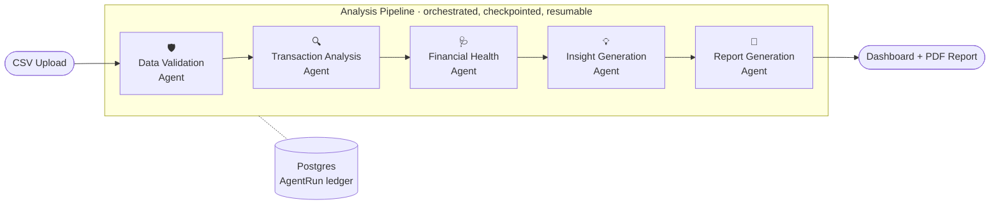
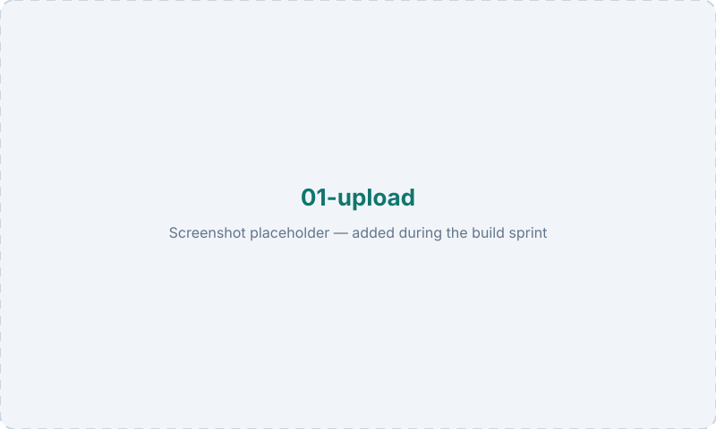
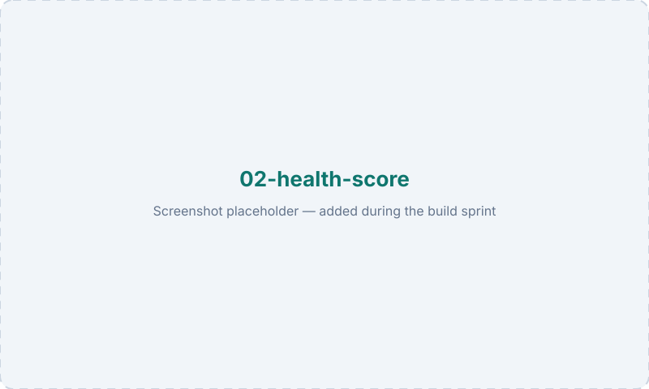
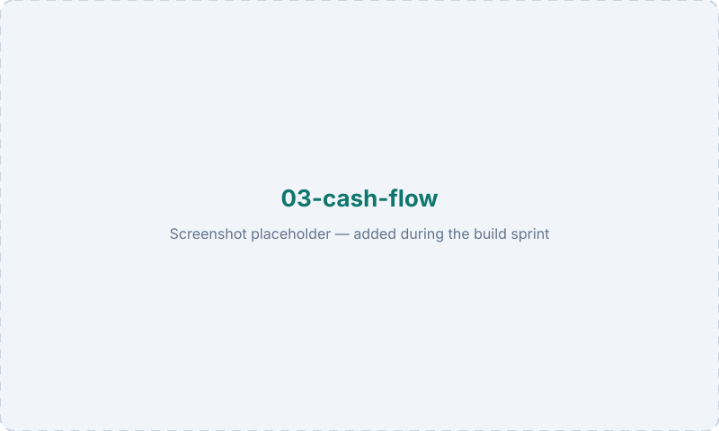
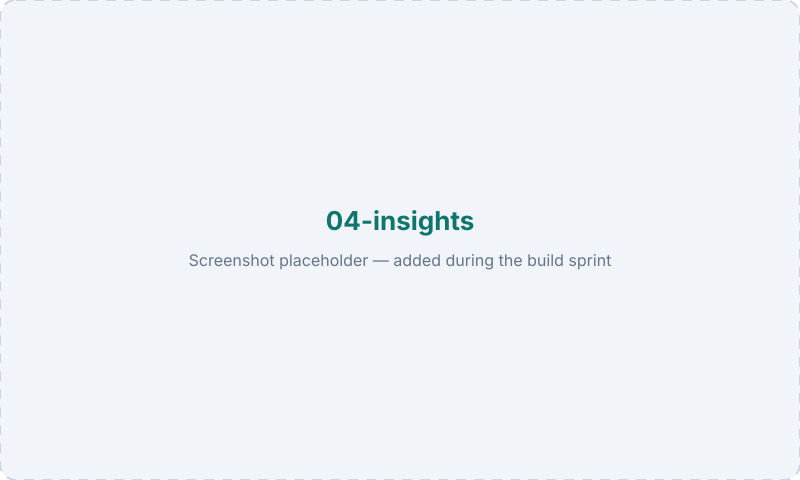
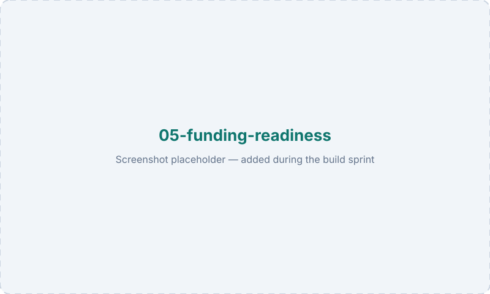
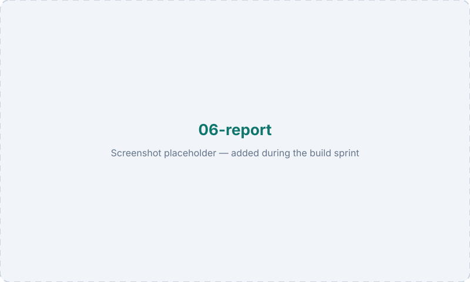

<div align="center">


### Transforming financial transactions into business intelligence.

**VitalFlow is an AI financial analyst for small and medium businesses.**
Upload a bank statement. Get the financial story behind it — health score, cash-flow diagnosis, risk signals, funding readiness, and what to do next.

[](LICENSE)
[](docs/ROADMAP.md)
[](https://nextjs.org)
[](https://www.typescriptlang.org)
[](CONTRIBUTING.md)

[Vision](#vision) · [Problem](#the-problem) · [Solution](#the-solution) · [Agents](#ai-agent-architecture) · [Architecture](docs/ARCHITECTURE.md) · [Roadmap](docs/ROADMAP.md) · [Contributing](CONTRIBUTING.md)

</div>

---

> [!NOTE]
> **This repository is currently documentation and scaffolding only.**
> No business logic has been implemented yet. This is deliberate: the architecture, agent contracts, scoring methodology, and API surface are being designed in the open *before* the first line of application code is written. See the [Roadmap](docs/ROADMAP.md) for what lands when.

---

## Vision

Every business owner has a financial story. Almost none of them can read it.

VitalFlow's vision is a world where a bakery in Bridgetown, a logistics operator in Lagos, or a two-person design studio in Kingston has the same quality of financial insight that a venture-backed company gets from a full-time CFO — delivered in seconds, from data they already have.

We believe cash flow is the most under-used asset in small business. It is already recorded, already trusted by lenders, and already sitting in every bank statement. It just isn't *readable*. VitalFlow makes it readable — first for the owner, then for the institutions that decide whether to fund them.

---

## The Problem

**Small businesses have financial data. They do not have financial understanding.**

A bank statement tells a business owner what happened. It does not tell them what it *means*.

| What the owner sees | What they actually need to know |
| --- | --- |
| A list of 400 transactions | Is my revenue becoming more predictable or less? |
| A closing balance | How many months can I survive if income stops? |
| Total expenses for the month | Which costs are quietly growing faster than my income? |
| A negative month | Is this a seasonal dip or the start of a trend? |
| "The bank said no" | What specifically makes me un-fundable, and how do I fix it? |

The gap has three causes:

1. **Bookkeeping tools answer the wrong question.** Accounting software is built for *recording* and *compliance*. It tells you what happened; it does not diagnose what is going wrong or recommend what to change.
2. **Financial analysis is expensive.** A fractional CFO or business advisor is out of reach for a business doing modest monthly revenue — which is most businesses.
3. **The data is fragmented and messy.** Bank exports differ by institution, by country, and sometimes by branch. There is no standard format, so no standard insight.

### Why this matters

MSMEs are the majority of businesses in most emerging markets — and in the Caribbean specifically, [80–90% of businesses are MSMEs](https://futurecaribbean.com/tracks/financial). They are also systematically underfinanced, because lending in these markets is **collateral-based rather than cash-flow-based**. A profitable, stable, well-run business with no property to pledge still gets declined.

That is not a capital problem. It is a **legibility** problem. The cash flow that would prove creditworthiness exists — it's just never been turned into a structured, comparable, verifiable financial profile.

VitalFlow attacks both sides of that gap at once:

- **For the business owner:** understand your own financial health, in plain language, with specific actions.
- **For the lender (Phase 3):** receive a standardised, consent-shared, cash-flow-derived credit profile for a business that would otherwise be invisible.

---

## The Solution

VitalFlow is an **AI financial analyst**, not bookkeeping software.

It ingests raw transaction data, runs it through a pipeline of specialised AI agents, and returns a complete business health assessment — the kind of read a seasoned CFO would give after a week with your books, delivered in under a minute.

### What VitalFlow is *not*

- ❌ Not bookkeeping software — it does not maintain ledgers or produce statutory accounts
- ❌ Not accounting software — it does not do reconciliation, tax filing, or double-entry
- ❌ Not a dashboard that just renders your balance in a nicer font
- ❌ Not a black box that outputs a number with no reasoning

### The core design principle: **deterministic core, AI narrative**

This is the single most important architectural decision in the project, and it exists because financial software must be *auditable*.

```
Numbers are computed. Meaning is generated.
```

- Every metric — health score, volatility, runway, concentration, growth rate — is calculated by **deterministic TypeScript**, is unit-tested, and is reproducible from the same input.
- The **LLM never invents a figure.** It receives computed metrics and produces explanation, prioritisation, and recommendation.
- Every insight carries provenance: which metric produced it, and which transactions produced that metric.

If a business owner asks "why is my score 63?", VitalFlow can answer that question all the way down to the individual transaction. See [SCORING_METHODOLOGY.md](docs/SCORING_METHODOLOGY.md) and [ADR-0002](docs/adr/0002-deterministic-core-narrative-llm.md).

---

## Core Features

| | Feature | Description |
| --- | --- | --- |
| 📄 | **Statement ingestion** | CSV upload with intelligent column mapping — handles the fact that no two banks export the same shape |
| 🧮 | **Financial Health Score** | A 0–100 composite across five weighted pillars, with a full breakdown of what drove it |
| 💧 | **Cash-flow diagnosis** | Inflow/outflow rhythm, volatility, negative-month detection, liquidity buffer and runway |
| 📈 | **Income & expense trends** | Month-over-month direction, growth rates, and whether expenses are outpacing revenue |
| 🔁 | **Recurring transaction detection** | Identifies subscriptions, rent, loan repayments, retainers — the fixed spine of the business |
| 🎯 | **Revenue quality analysis** | Predictability, customer concentration, recurring vs one-off share |
| 🚨 | **Risk indicators** | Overdraft events, returned payments, unusual outflows, concentration risk, seasonality exposure |
| 🏦 | **Funding readiness** | A lender's-eye view: what a credit officer would see, what would disqualify you, and what to fix first |
| 💡 | **Prioritised recommendations** | Specific, ranked, quantified actions — not "reduce expenses" but which expense, by how much, and the projected effect |
| 📑 | **PDF report** | A shareable, professionally typeset report for your own use, your bank, or an investor |
| 🌍 | **Multi-currency** | Built for XCD, TTD, JMD, BBD, GYD, NGN, USD and more — locale-aware formatting from day one |

---

## Example User Workflow

**Meet Amara.** She runs a five-person catering business. She banks with a local bank, has no accountant, and was declined for a working-capital loan last month with no explanation.

```
 1. Amara exports 12 months of transactions from her online banking as CSV.

 2. She drops the file into VitalFlow.
    → The Data Validation Agent detects the column layout, normalises 1,184
      transactions, flags 3 rows with unparseable dates, and asks her to confirm
      the currency is XCD.

 3. She clicks "Analyse".
    → The pipeline runs. She watches each agent complete in real time:
      validated → analysed → scored → interpreted → reported.   (~40 seconds)

 4. She gets her assessment:

    ┌─────────────────────────────────────────────────────────────┐
    │  FINANCIAL HEALTH SCORE                                     │
    │                                                             │
    │              63 / 100    ·   WATCH                          │
    │                                                             │
    │  Cash Flow Stability      ███████░░░  17 / 25               │
    │  Revenue Quality          ██████░░░░  14 / 25               │
    │  Expense Discipline       ████████░░  16 / 20               │
    │  Liquidity & Runway       ████░░░░░░   9 / 20               │
    │  Risk Profile             ███████░░░   7 / 10               │
    └─────────────────────────────────────────────────────────────┘

 5. She reads what it actually means:

    "Your revenue grew 18% over the year, but it is highly concentrated —
     two clients account for 61% of income. In the three months where the
     larger client paid late, you went into overdraft. Your operating
     runway is 1.4 months, which is the single biggest constraint on
     your fundability."

 6. She gets ranked actions:

    ① Reduce single-client dependence below 40% of revenue.
      → Your concentration is the largest drag on the score (−8 pts).
    ② Build a cash buffer to 2.5 months of operating expenses (~$14,200).
      → Would move Liquidity & Runway from 9/20 to 15/20.
    ③ Move the 3 largest variable costs onto fixed monthly terms.
      → Reduces month-to-month outflow volatility by an estimated 22%.

 7. Funding readiness: "Building — not yet ready."
    Specific blockers listed, each with the change that would clear it.

 8. She downloads the PDF and takes it back to her loan officer.
```

That last step is the point. VitalFlow does not just tell Amara she was declined — it tells her *why*, and gives her something to hand back across the desk.

---

## AI Agent Architecture

VitalFlow is built as a **pipeline of cooperating agents**, each with exactly one responsibility, each with a typed input and output contract, each independently testable and replaceable.



| Agent | Single responsibility | Consumes | Produces |
| --- | --- | --- | --- |
| 🛡️ **Data Validation** | Make untrusted data trustworthy | Raw CSV | Normalised, typed transactions + data-quality report |
| 🔍 **Transaction Analysis** | Find the patterns | Clean transactions | Categories, recurring series, counterparties, monthly aggregates |
| 🩺 **Financial Health** | Quantify the condition | Patterns + aggregates | Health score, pillar breakdown, risk flags, runway |
| 💡 **Insight Generation** | Explain and advise | Metrics + score | Plain-language narrative, ranked recommendations, funding readiness |
| 📑 **Report Generation** | Make it shareable | Everything above | Structured report model → PDF |

**Why a pipeline of narrow agents instead of one large prompt?**

- **Auditability** — every stage writes an `AgentRun` record with inputs, outputs, model, token cost, and duration. Regulators and lenders can trace any conclusion to its source.
- **Testability** — each agent has a fixture-based contract test. You can change one without regressing the others.
- **Cost control** — only the stages that need an LLM call one; validation and metric computation are pure code.
- **Resumability** — a failure in stage 4 does not re-run stages 1–3.
- **Replaceability** — swapping the model, or replacing a stage with a fine-tuned or rules-based implementation, is a local change.

Full contracts, prompts, guardrails, and failure modes: **[docs/AGENTS.md](docs/AGENTS.md)**

---

## Screenshots

> Placeholders — the interface is designed but not yet implemented. These will be replaced during the build sprint.

| Upload & mapping | Health score |
| --- | --- |
|  |  |

| Cash-flow analysis | Insights & recommendations |
| --- | --- |
|  |  |

| Funding readiness | PDF report |
| --- | --- |
|  |  |

---

## Tech Stack

| Layer | Choice | Why |
| --- | --- | --- |
| **Framework** | Next.js 15 (App Router) | Server components + route handlers in one deployable; fast to ship, easy to host |
| **Language** | TypeScript (strict) | Financial types must not be `any` — money, currency, and dates are modelled explicitly |
| **Styling** | Tailwind CSS | Consistent design tokens, no CSS drift |
| **Components** | shadcn/ui | Accessible primitives we own outright, not a dependency we rent |
| **ORM** | Prisma | Typed schema shared between app and agents |
| **Database** | PostgreSQL | Relational integrity for financial records; JSONB for agent payloads |
| **LLM** | OpenAI-compatible API | Provider-agnostic interface — swap models without touching agent logic |
| **Parsing** | Papa Parse | Battle-tested streaming CSV parsing for messy real-world exports |
| **Charts** | Recharts | Composable, accessible, React-native charting |
| **PDF** | React-PDF / Playwright | Deterministic, typeset reports |
| **Validation** | Zod | One schema for API contracts, agent I/O, and LLM structured output |
| **Testing** | Vitest + Playwright | Unit tests on the deterministic core; E2E on the upload→report path |

---

## Repository Structure

```
VitalFlow/
├── app/                      # Next.js App Router
│   ├── (marketing)/          # Public landing pages
│   ├── (dashboard)/          # Authenticated product surface
│   │   ├── dashboard/        # Analysis list + overview
│   │   └── analysis/         # Single analysis detail view
│   └── api/v1/               # Versioned route handlers
│
├── agents/                   # The five agents + orchestrator
│   ├── orchestrator/         # Pipeline execution, checkpointing, retries
│   ├── data-validation/
│   ├── transaction-analysis/
│   ├── financial-health/
│   ├── insight-generation/
│   ├── report-generation/
│   └── shared/               # Agent base contracts, tracing, cost accounting
│
├── prompts/                  # Versioned system prompts (one file per agent)
│
├── lib/                      # Framework-agnostic core
│   ├── csv/                  # Parsing, column inference, normalisation
│   ├── analysis/             # Deterministic financial mathematics
│   ├── llm/                  # Provider-agnostic LLM client
│   ├── pdf/                  # Report rendering
│   └── db/                   # Prisma client + query helpers
│
├── components/               # React components
│   ├── ui/                   # shadcn/ui primitives
│   ├── charts/               # Recharts wrappers
│   ├── upload/               # Upload + column mapping flow
│   ├── report/               # Score, insight, and report surfaces
│   └── marketing/            # Landing page sections
│
├── types/                    # Shared TypeScript contracts
├── prisma/                   # Schema + migrations
├── docs/                     # Architecture, agents, API, roadmap, ADRs
├── public/                   # Static assets, brand, screenshots
├── scripts/                  # Dev + operational scripts
├── tests/                    # Unit, contract, and E2E tests + fixtures
└── .github/                  # CI, issue templates, PR template
```

---

## Installation

> The application is not implemented yet — these steps describe the intended developer setup and will be valid from **v0.1.0** onward.

### Prerequisites

- Node.js `>= 20.11` (see [`.nvmrc`](.nvmrc))
- PostgreSQL `>= 15` (or Docker)
- An OpenAI-compatible API key

### Setup

```bash
# 1. Clone
git clone https://github.com/hasbunallah01/VitalFlow.git
cd VitalFlow

# 2. Install dependencies
npm install

# 3. Configure environment
cp .env.example .env.local
#    → set DATABASE_URL and LLM_API_KEY

# 4. Start Postgres (optional — if you aren't running one already)
docker compose up -d db

# 5. Apply the schema
npx prisma migrate dev

# 6. Run
npm run dev
```

Open <http://localhost:3000>.

A sample statement for testing lives at [`tests/fixtures/sample-statement.csv`](tests/fixtures/sample-statement.csv).

### Common commands

```bash
npm run dev            # Development server
npm run build          # Production build
npm run lint           # ESLint
npm run typecheck      # tsc --noEmit
npm run test           # Vitest
npm run db:studio      # Prisma Studio
```

---

## Development Roadmap

| Phase | Milestone | Scope |
| --- | --- | --- |
| **Phase 0** ✅ | Foundations | Documentation, architecture, agent contracts, scoring methodology, scaffolding |
| **Phase 1** 🔨 | MVP — *buildathon sprint* | CSV upload → validation → analysis → score → insights → PDF, end to end |
| **Phase 2** | Depth | Multi-statement history, period comparison, benchmarks, saved analyses, auth |
| **Phase 3** | The credit layer | Consent-based lender sharing, standardised underwriting profile, partner API |
| **Phase 4** | Connected data | Bank/Open Banking connections, POS and invoicing integrations, continuous monitoring |
| **Phase 5** | Always-on | Autonomous monitoring agents, anomaly alerts, forward-looking cash-flow forecasting |

Detailed, dated breakdown: **[docs/ROADMAP.md](docs/ROADMAP.md)**

---

## Future Improvements

- **Cash-flow forecasting** — 30/60/90-day projections with confidence intervals
- **Peer benchmarking** — anonymised, sector- and market-relative comparison ("your rent is 31% of revenue; comparable caterers average 19%")
- **Scenario modelling** — "what happens to my runway if my largest client leaves?"
- **Continuous monitoring** — always-on agents that alert on drift rather than waiting for an upload
- **Lender decision-support API** — VitalFlow as underwriting infrastructure, not just a report
- **Invoice and receivables intelligence** — days-sales-outstanding, chronic late payers
- **Multi-account consolidation** — several bank accounts as one business view
- **Statement format library** — a growing, community-contributed set of bank export profiles
- **PDF and image statement ingestion** — OCR for businesses whose bank offers no CSV export
- **Offline-tolerant and low-bandwidth modes** — real constraints in island and rural markets
- **Localisation** — English, Spanish, French, and Dutch for the wider Caribbean

---

## Documentation

| Document | Purpose |
| --- | --- |
| [ARCHITECTURE.md](docs/ARCHITECTURE.md) | System design, data flow, boundaries, deployment topology |
| [AGENTS.md](docs/AGENTS.md) | Agent contracts, prompts, guardrails, failure modes |
| [API_PLAN.md](docs/API_PLAN.md) | REST surface, payloads, errors, events, versioning |
| [DATA_MODEL.md](docs/DATA_MODEL.md) | Entities, relationships, invariants |
| [SCORING_METHODOLOGY.md](docs/SCORING_METHODOLOGY.md) | How the Financial Health Score is computed |
| [SECURITY_PRIVACY.md](docs/SECURITY_PRIVACY.md) | Data handling, PII redaction, retention, consent |
| [DESIGN_SYSTEM.md](docs/DESIGN_SYSTEM.md) | Brand, colour, typography, component principles |
| [ROADMAP.md](docs/ROADMAP.md) | Phased delivery plan |
| [GLOSSARY.md](docs/GLOSSARY.md) | Financial and domain terminology |
| [BUILDATHON.md](docs/BUILDATHON.md) | FutureCaribbean 2026 context and track alignment |
| [ADRs](docs/adr/) | Architecture decision records |

---

## Contributing

Contributions are welcome — especially bank statement format profiles, financial methodology review, and localisation.

Start with [CONTRIBUTING.md](CONTRIBUTING.md), and read [AGENTS.md](docs/AGENTS.md) before touching anything under `agents/` or `prompts/`.

By participating you agree to the [Code of Conduct](CODE_OF_CONDUCT.md).

---

## Buildathon Context

VitalFlow is being prepared for the **FutureCaribbean 2026 Global Agentic AI Buildathon**, under the **Finance, Payments & MSME Capital** track.

That track's brief is explicit: build the **MSME credit layer** — systems that aggregate fragmented business data, generate real-time credit profiles, and enable cash-flow-based lending where collateral-based lending has failed. It also sets a clear bar: *strong teams build financial infrastructure; weak teams build apps.*

VitalFlow's answer to that bar is that the business-owner product and the lender infrastructure are the **same engine**. The analysis that tells Amara why her runway is thin is the same structured, auditable, cash-flow-derived profile a credit officer needs to underwrite her without collateral. One earns trust and distribution; the other moves capital.

More detail: [docs/BUILDATHON.md](docs/BUILDATHON.md)

---

## Disclaimer

VitalFlow produces analytical and educational output. It is **not** financial, investment, legal, tax, or accounting advice, and it is not a substitute for a licensed professional. Analyses are derived solely from the transaction data supplied by the user and are only as complete as that data. Business decisions remain the responsibility of the business owner.

---

## License

Released under the [MIT License](LICENSE).

---

<div align="center">

**VitalFlow** — because every business has a financial story worth understanding.

</div>
