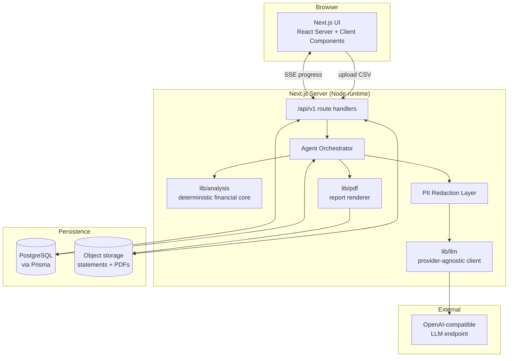
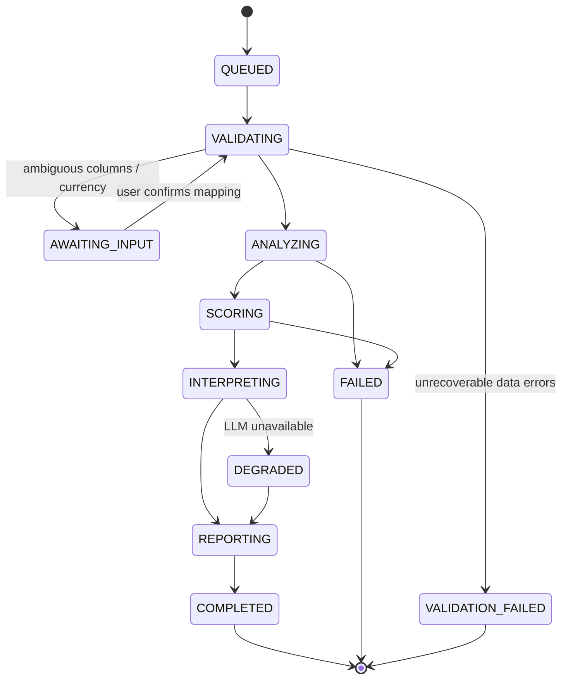

# Architecture

> Status: **Design — pre-implementation.** This document is the source of truth for how VitalFlow is built. Code that contradicts it is either a bug or a reason to amend this document via an [ADR](adr/).

---

## 1. Design principles

These are ordered. When two conflict, the higher one wins.

1. **Correctness over cleverness.** This is financial software. A wrong number is worse than no number.
2. **Deterministic core, AI narrative.** Every figure is computed in code and reproducible. The LLM explains, prioritises, and advises — it never calculates. ([ADR-0002](adr/0002-deterministic-core-narrative-llm.md))
3. **Every conclusion is traceable.** Insight → metric → transaction. No orphan claims.
4. **Agents are narrow and contracted.** One responsibility, typed input, typed output, testable in isolation.
5. **Privacy by default.** Personally identifying detail is redacted before it ever reaches a model provider. ([SECURITY_PRIVACY.md](SECURITY_PRIVACY.md))
6. **Degrade, don't fail.** Partial data produces a partial analysis with stated confidence, not an error page.
7. **Portable by construction.** No lock-in to a single LLM provider, bank, or country's data format.

---

## 2. System overview



### Layer responsibilities

| Layer | Owns | Must not |
| --- | --- | --- |
| **UI** (`app/`, `components/`) | Presentation, interaction, progressive disclosure | Compute financial metrics, call the LLM directly |
| **API** (`app/api/v1/`) | Auth, validation, request/response shape, rate limits | Contain analysis logic |
| **Orchestrator** (`agents/orchestrator/`) | Pipeline sequencing, checkpointing, retries, cost accounting | Know how any individual agent works internally |
| **Agents** (`agents/*/`) | One analytical responsibility each | Reach across to another agent's internals or the database directly |
| **Core** (`lib/analysis/`) | All financial mathematics | Perform I/O, know about HTTP, or call an LLM |
| **LLM client** (`lib/llm/`) | Provider abstraction, retries, structured output, token accounting | Contain domain logic or prompts |
| **Persistence** (`lib/db/`, `prisma/`) | Storage and retrieval | Contain business rules |

The dependency direction is strictly inward: `app → agents → lib/analysis`. `lib/analysis` depends on nothing but types.

---

## 3. The analysis pipeline

An **Analysis** is a single run of the pipeline over a single **Statement**. It is a first-class persisted entity with a state machine — not a request/response call.



Notes:

- **`DEGRADED`** is deliberate. If the LLM is unavailable, the deterministic score, metrics, and charts are still valid and are still delivered — only the narrative is missing. The report states this clearly.
- **`AWAITING_INPUT`** keeps the human in the loop exactly where machines are weakest: interpreting an unfamiliar bank's column layout.
- Each transition writes an `AgentRun` row. The pipeline is resumable from the last successful checkpoint.

### Execution model

**MVP:** in-process execution inside the Next.js Node runtime, with the analysis record acting as the checkpoint store. Progress is streamed to the client over Server-Sent Events.

**Phase 2+:** the orchestrator moves behind a queue (BullMQ or pg-boss) so that long-running and always-on monitoring analyses do not occupy request handlers. The agent contracts do not change — this is why the orchestrator is a separate module from day one.

---

## 4. Data flow: upload to report

```
CSV file
  │
  ├─▶ [1] Ingestion            Stream-parse, cap rows, detect encoding & delimiter
  │                             → RawStatement rows (untrusted)
  │
  ├─▶ [2] Data Validation      Column inference → normalisation → typed Transaction[]
  │       Agent                 + DataQualityReport (confidence, dropped rows, warnings)
  │
  ├─▶ [3] Transaction          Categorisation, recurring-series detection,
  │       Analysis Agent        counterparty clustering, monthly aggregation
  │                             → TransactionAnalysis
  │
  ├─▶ [4] Financial Health     Deterministic metrics → pillar scores → composite score
  │       Agent                 → HealthAssessment (+ risk flags, runway, readiness tier)
  │
  ├─▶ [5] Insight Generation   Redact → LLM → structured insights & ranked recommendations
  │       Agent                 → InsightSet (each insight cites its source metric)
  │
  └─▶ [6] Report Generation    Compose report model → render PDF → store
          Agent                 → Report
```

Every arrow is a typed boundary defined in `types/` and validated with Zod at runtime. An agent that receives malformed input from the previous stage fails loudly rather than guessing.

---

## 5. The deterministic core

`lib/analysis/` is the heart of VitalFlow's credibility. It is pure, synchronous, dependency-free TypeScript.

| Module | Computes |
| --- | --- |
| `cashflow.ts` | Net flow by period, negative-month count, balance volatility, drawdowns |
| `revenue.ts` | Inflow classification, growth trend (OLS), coefficient of variation, concentration (HHI) |
| `expenses.ts` | Fixed/variable split, category shares, growth vs revenue growth |
| `recurring.ts` | Periodicity detection over amount/counterparty/date clusters |
| `liquidity.ts` | Average buffer, burn rate, operating runway, days cash on hand |
| `anomalies.ts` | Statistical outliers, overdraft events, returned payments, structural breaks |
| `score.ts` | Pillar scoring and composite Financial Health Score |
| `money.ts` | Minor-unit integer arithmetic, currency, rounding — no floats for money |

Rules for this directory:

- **No floating-point money.** Amounts are integer minor units with an explicit currency code.
- **No I/O.** Every function is `(input) => output`.
- **No LLM.** Ever.
- **Test coverage target: 90%+**, with golden-file tests over fixture statements.

See [SCORING_METHODOLOGY.md](SCORING_METHODOLOGY.md) for the formulae.

---

## 6. LLM integration

```
Metrics + aggregates
      │
      ▼
 [ Redaction ]   account numbers, counterparty names → stable pseudonyms
      │           (mapping held server-side, re-hydrated after the response)
      ▼
 [ Prompt assembly ]  versioned system prompt + JSON context + JSON schema
      │
      ▼
 [ LLM call ]    temperature 0.2–0.4, structured output enforced, timeout + retry
      │
      ▼
 [ Validation ]  Zod parse → reject if the model asserts a number not present in context
      │
      ▼
 [ Re-hydration ]  pseudonyms → real names for display only
```

Guardrails:

- **Structured output only.** Free-form prose is never persisted as a metric.
- **No arithmetic delegated to the model.** If a response contains a figure, it must match a value supplied in the context; violations are dropped and logged.
- **Bounded context.** The model receives aggregates and exemplars, never the full transaction list.
- **Prompts are versioned files** under `prompts/`, referenced by ID in every `AgentRun` so any historical output can be reproduced.
- **Cost is recorded** per run — token counts and estimated cost, per agent, per analysis.

---

## 7. Persistence

Postgres via Prisma. Full entity definitions in [DATA_MODEL.md](DATA_MODEL.md).

Key decisions:

- **Transactions are immutable** once validated. Corrections create a new `Statement` version rather than mutating history.
- **Agent payloads are JSONB.** Analytical outputs evolve fast; forcing them into columns early would be premature. Anything queried across analyses gets promoted to a real column.
- **`AgentRun` is an append-only ledger** — the audit backbone. It records agent, version, prompt ID, model, input hash, output, duration, tokens, and cost.
- **Raw uploads are stored separately** from parsed data, with their own retention policy.

---

## 8. Security and multi-tenancy

- Every business-scoped row carries an `organizationId`; queries go through repository helpers that require it. No ad-hoc unscoped Prisma calls.
- Uploaded files are stored outside the web root with signed, expiring access URLs.
- Raw statement files are deleted on a configurable retention timer (default 30 days); derived analyses persist.
- PII is redacted before egress to any third-party model provider.
- All mutating endpoints require authentication (Phase 2 onward); the MVP uses anonymous session-scoped analyses with no cross-session access.

Detail: [SECURITY_PRIVACY.md](SECURITY_PRIVACY.md).

---

## 9. Deployment topology

```
            ┌──────────────────────────────┐
 Users ────▶│  Vercel / Node host           │
            │  Next.js (SSR + route handlers)│
            └───────────┬───────────────────┘
                        │
        ┌───────────────┼────────────────┐
        ▼               ▼                ▼
  ┌───────────┐  ┌──────────────┐  ┌──────────────┐
  │ Postgres  │  │ Object store │  │ LLM endpoint │
  │ (managed) │  │ (S3-compat)  │  │ (OpenAI-comp)│
  └───────────┘  └──────────────┘  └──────────────┘
```

MVP runs as a single deployable. The orchestrator boundary means the pipeline can be lifted into a worker process later without touching agents.

---

## 10. Observability

| Signal | Mechanism |
| --- | --- |
| Pipeline progress | SSE stream + `AgentRun` rows |
| Errors | Structured logs with `analysisId` correlation |
| LLM cost | Tokens and cost per agent run, aggregated per analysis |
| Data quality | `DataQualityReport` persisted per statement — feeds the statement-format library |
| Performance | Duration per agent; target p95 under 60s end-to-end for a 12-month statement |

---

## 11. Known constraints and open questions

- **Bank format diversity** is the biggest ingestion risk. Mitigation: column inference plus a growing library of named bank profiles, plus human confirmation when confidence is low.
- **Balance columns are often absent**, which weakens liquidity and runway metrics. The scoring model must degrade gracefully and say so rather than silently guessing.
- **Personal and business finances are frequently mixed** in MSME accounts. Phase 2 should detect and flag this rather than pretend it isn't happening.
- **Score calibration** is currently expert-designed, not empirically fitted. Validating it against real lending outcomes is a Phase 3 objective and is stated openly in the product.
- **Multi-currency accounts** are out of scope for the MVP: one statement, one currency.
