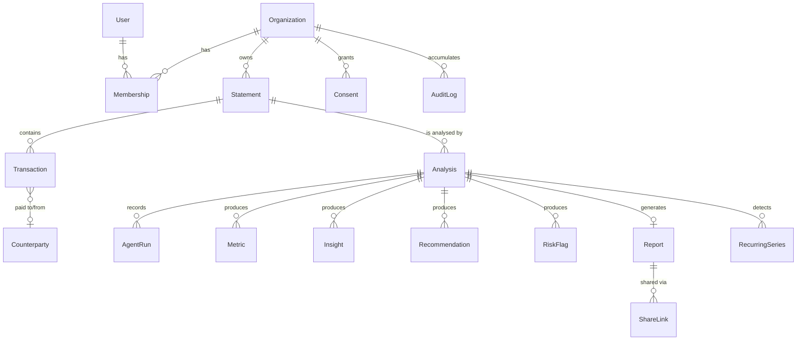

# Data Model

> Entity design for VitalFlow. The Prisma schema in [`prisma/schema.prisma`](../prisma/schema.prisma) is the draft implementation of this document.

---

## Entity relationship overview

---

## Core entities

### `Organization`

The business. Every financial record is scoped to exactly one.

| Field | Type | Notes |
| --- | --- | --- |
| `id` | `String` | `org_` ULID |
| `name` | `String` | |
| `country` | `String?` | ISO 3166-1 alpha-2 |
| `defaultCurrency` | `String` | ISO 4217 |
| `sector` | `String?` | Enables sector-aware thresholds (Phase 2) |
| `createdAt` / `updatedAt` | `DateTime` | |

> **Invariant:** every query touching financial data filters on `organizationId`. Enforced through repository helpers in `lib/db/`; unscoped Prisma calls are a review-blocking defect.

---

### `Statement`

An uploaded bank statement — the raw artifact plus its validation outcome.

| Field | Type | Notes |
| --- | --- | --- |
| `id` | `String` | `stm_` ULID |
| `organizationId` | `String` | |
| `filename` | `String` | Original name, for the user's reference |
| `fileRef` | `String` | Object storage key — **never** a public path |
| `sizeBytes` | `Int` | |
| `checksum` | `String` | SHA-256 — detects re-uploads of identical files |
| `status` | `StatementStatus` | `uploaded` · `validating` · `validated` · `rejected` |
| `currency` | `String?` | Resolved during validation |
| `periodStart` / `periodEnd` | `DateTime?` | |
| `columnMapping` | `Json?` | Resolved mapping, reusable for the same bank next time |
| `hasBalanceColumn` | `Boolean` | Materially affects liquidity confidence |
| `qualityReport` | `Json?` | `DataQualityReport` |
| `retentionExpiresAt` | `DateTime?` | Raw file deletion timer (default +30 days) |

**Immutability:** a validated statement is never mutated. A corrected upload is a new `Statement`, optionally linked via `supersedesId`.

---

### `Transaction`

A single normalised movement of money.

| Field | Type | Notes |
| --- | --- | --- |
| `id` | `String` | `txn_` ULID |
| `statementId` | `String` | |
| `organizationId` | `String` | Denormalised for query scoping |
| `date` | `Date` | Value date |
| `description` | `String` | Original text, untouched |
| `normalizedDescription` | `String` | Cleaned — references and IDs stripped |
| `amountMinor` | `BigInt` | **Signed integer minor units.** Positive = inflow |
| `currency` | `String` | |
| `balanceMinor` | `BigInt?` | Null when the bank does not provide it |
| `direction` | `Direction` | `inflow` · `outflow` — derived, indexed |
| `category` | `String?` | |
| `categorySource` | `CategorySource?` | `rule` · `llm` · `user` — audit trail for every label |
| `counterpartyId` | `String?` | |
| `isTransfer` | `Boolean` | Internal movement, excluded from revenue and expense |
| `isRecurring` | `Boolean` | Member of a detected series |
| `recurringSeriesId` | `String?` | |
| `rowNumber` | `Int` | Source row — enables "show me this in my file" |

**Indexes:** `(organizationId, date)`, `(statementId, date)`, `(counterpartyId)`, `(recurringSeriesId)`.

> **Why `BigInt` minor units:** floating-point money produces figures that cannot be defended. A cent is an integer. See [ADR-0004](adr/0004-money-as-integer-minor-units.md).

---

### `Counterparty`

A clustered payer or payee. `"ACME LTD 4471"`, `"ACME LIMITED"` and `"ACME LTD/INV22"` are one entity — without this, concentration analysis is meaningless.

| Field | Type | Notes |
| --- | --- | --- |
| `id` | `String` | `cpt_` ULID |
| `organizationId` | `String` | |
| `displayName` | `String` | |
| `normalizedKey` | `String` | Clustering key |
| `type` | `CounterpartyType` | `customer` · `supplier` · `employee` · `institution` · `internal` · `unknown` |
| `totalInflowMinor` / `totalOutflowMinor` | `BigInt` | |
| `transactionCount` | `Int` | |
| `firstSeen` / `lastSeen` | `Date` | |

---

### `RecurringSeries`

| Field | Type | Notes |
| --- | --- | --- |
| `id` | `String` | `rec_` ULID |
| `analysisId` | `String` | |
| `label` | `String` | |
| `direction` | `Direction` | |
| `cadence` | `Cadence` | `weekly` · `biweekly` · `monthly` · `quarterly` · `irregular` |
| `medianAmountMinor` | `BigInt` | |
| `amountVariance` | `Float` | |
| `confidence` | `Float` | |
| `isActive` | `Boolean` | Still running at period end |
| `isFixedObligation` | `Boolean` | Feeds fixed-cost coverage |

---

### `Analysis`

One run of the pipeline. The central object of the product.

| Field | Type | Notes |
| --- | --- | --- |
| `id` | `String` | `anl_` ULID |
| `organizationId` / `statementId` | `String` | |
| `status` | `AnalysisStatus` | Mirrors the state machine in [ARCHITECTURE.md](ARCHITECTURE.md#3-the-analysis-pipeline) |
| `stage` | `String?` | Current agent, for progress display |
| `progressPercent` | `Int` | |
| `score` | `Int?` | 0–100 |
| `band` | `HealthBand?` | |
| `pillars` | `Json?` | Pillar scores with sub-metrics and confidence |
| `confidence` | `Float?` | |
| `fundingTier` | `FundingTier?` | |
| `scoringVersion` | `String` | e.g. `scoring@1.0.0` — historical scores stay interpretable after recalibration |
| `degraded` | `Boolean` | Completed without narrative |
| `failureCode` / `failureMessage` | `String?` | |
| `totalTokens` / `estimatedCostMicros` | `Int` / `BigInt` | Cost accounting per analysis |
| `startedAt` / `completedAt` | `DateTime?` | |

---

### `AgentRun`

**Append-only.** The audit backbone — this is what makes a VitalFlow conclusion defensible to a third party.

| Field | Type | Notes |
| --- | --- | --- |
| `id` | `String` | `run_` ULID |
| `analysisId` | `String` | |
| `agent` | `String` | e.g. `insight-generation` |
| `agentVersion` | `String` | |
| `promptId` | `String?` | e.g. `insight-generation@v1` |
| `model` | `String?` | |
| `inputHash` | `String` | SHA-256 of the input payload — reproducibility |
| `output` | `Json?` | |
| `status` | `RunStatus` | `completed` · `failed` · `skipped` · `degraded` |
| `warnings` | `Json` | |
| `tokensIn` / `tokensOut` | `Int?` | |
| `durationMs` | `Int` | |
| `startedAt` / `finishedAt` | `DateTime` | |

Never updated, never deleted while its analysis exists.

---

### `Metric`, `Insight`, `Recommendation`, `RiskFlag`

| Entity | Key fields |
| --- | --- |
| **`Metric`** | `key`, `value`, `unit`, `currency?`, `pillar?`, `confidence` — every computed figure, individually addressable |
| **`Insight`** | `title`, `explanation`, `severity`, `sourceMetrics[]`, `evidenceTransactionIds[]` |
| **`Recommendation`** | `action`, `rationale`, `priority`, `effort`, `pillar`, `estimatedPointGain`, `timeframe` |
| **`RiskFlag`** | `code`, `severity`, `detail`, `pointsDeducted`, `evidenceTransactionIds[]` |

> **Invariant:** `Insight.sourceMetrics` must be non-empty. An insight without provenance is rejected at the agent boundary, not merely discouraged.

---

### `Report`, `ShareLink`

| `Report` field | Notes |
| --- | --- |
| `id` | `rpt_` ULID |
| `analysisId` | |
| `pdfRef` | Object storage key |
| `model` | `Json` — structured report model, so a PDF can be re-rendered without re-analysing |
| `disclaimerVersion` | Which disclaimer text this document carries |
| `pages`, `generatedAt` | |

| `ShareLink` field | Notes |
| --- | --- |
| `token` | High-entropy, single-purpose |
| `expiresAt` | Default +14 days |
| `revokedAt` | Nullable |
| `accessCount`, `lastAccessedAt` | Every view is counted and visible to the owner |

---

## Phase 3 entities

### `Consent`

The legal and technical backbone of the credit layer.

| Field | Notes |
| --- | --- |
| `organizationId` | The business granting access |
| `granteeId` | The lender or partner |
| `scope` | Which resources — profile, metrics, report |
| `purpose` | Stated reason, shown to the business owner |
| `grantedAt` / `expiresAt` / `revokedAt` | Time-bound and unilaterally revocable |

### `AuditLog`

Append-only record of every access to business financial data, by anyone, including partners. Visible to the business owner.

| Field | Notes |
| --- | --- |
| `actorType` | `user` · `partner` · `system` |
| `action` / `resourceType` / `resourceId` | |
| `ipHash` | Hashed, not raw |
| `occurredAt` | |

---

## Cross-cutting invariants

1. Every financial row carries `organizationId` and is queried through a scoped helper.
2. Money is `BigInt` minor units plus an explicit `currency`. No `Float`, no `Decimal` as an amount type, no implicit currency.
3. Validated transactions are immutable.
4. `AgentRun` and `AuditLog` are append-only.
5. Every analysis records the `scoringVersion` and prompt IDs that produced it.
6. Deleting a `Statement` cascades to its analyses, reports, and derived rows — the user's erasure path is real and complete.
7. Raw uploaded files have an independent, shorter retention window than derived analyses.
